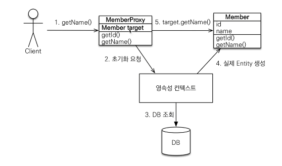

# SpringBoot-JPA
## ★ 영속성 컨텍스트 (PersistenceContext) ★

- "엔티티를 영구 저장하는 환경" 이라는 뜻
- EntityManager를 통해서 영속성 컨텍스트에 접근 가능
  (EntityManager 1 : 1 PersistenceContext) 관계

 

### ► 1차 캐시
- em.find(), em.update() ... 등 메소드 실행시 디비에 바로 적용하지 않고 영속성 컨텍스트에서 해당 객체의 @Id로 지정된 키값이 있는지 찾아서 있으면 디비에서 찾지 않고 바로 가져온다.
  
- 만약 영속성 컨텍스트에 없는 값을 조회시 디비에서 조회해온후 영속성 컨텍스트에 1차캐시에 등록후 결과를 반환해준다.

### ► 영속성엔티티의 동일성 보장
- 영속성 컨텍스트에서 관리중인 키의 
- c객체를 여러번 반복 사용해도 다른값을 가지지 않는다.

### ► 트랜잭션을 지원하는 쓰기 지연
- em.persist() 메소드 실행시 먼저 1차 캐시에 객체를 등록한후, '쓰기 지연 SQL저장소'에 Insert쿼리를 생성하여 저장만 시켜놓는다.
- '쓰기 지연 SQL저장소'에 쌓인 쿼리들은 Transaction.commit() 메소드 실행과 동시에 데이터베이스에 날린다.(flush)

### ► 변경 감지
- 객체가 영속성 컨텍스트에 가장 처음 1차캐시에 등록될때 생성되는 값(@Id 키값, 객체, 객체 스냅샷(원본))
- 영속성 컨텍스트에서 가져온 객체를 수정할 경우 '객체.setName(변경값)'을 실행시 Transaction.commit()메소드 실행 시점에 객체와 객체 스냅샷을 비교하여 변경된 값을 업데이트 쿼리작성하여 '쓰기 지연 SQL저장소'에 저장한다. 

 
참고) flush() : Transaction.commit()이 실행될때 호출되는 메소드로서, 영속성 컨텍스트의 변경내용('쓰기 지연 SQL저장소'에 등록된 쿼리)을 데이터베이스에 반영하는 기능 - <label style="color:red;">flush()가 실행된 후에도 1차 캐시의 내용은 유지된다.</label>

#### flush() 호출 방법 
1. EntityManager.flush() - 직접 호출
2. EntityTransaction.commit() - 플러시 자동 호출
3. JQPL 쿼리 실행 - 플러시 자동 호출

---

## ★ 준영속 상태 ★

- 영속 상태의 엔티티가 영속성 컨텍스트에서 분리(detached)
- 영속성 컨텍스트가 제공하는 기능을 사용 못함

#### 준영속 성태 만드는 방법
1. EntityManager.detach(객체) - 영속성 컨텍스트에서 객체를 빼냄
2. em.clear() - 영속성 컨텍스트를 완전히 초기화 시킴.
3. em.close() - 영속성 컨텍스트를 종료함.

  
## ★ 객체와 테이블 매핑 ★ <label style='color:skyblue;'>참조 - Member.java</label>
1. 객체와 테이블 매핑 : @Entity, @Table
2. 필드와 컬럼 매핑 : @column
3. 기본키 매핑 : @Id
4. 연관관계 매핑 : @ManyToOne, @JoinColumn

### ▶ @Entity

- JPA를 사용해서 테이블과 매핑할 클래스에 필수인 어노테이션 
※ <label style='color:red;'>기본생성자 필수</label>(파라미터가 없는 public or protected 생성자)
  ※ final클래스, enum, interface, inner클래스에는 사용불가
  ※ 저장할 필드에 final 사용 불가
 
 
- 속성
1. name : 클래스의명을 지정한다. ex) 여러 클래스가 하나의 테이블에 매핑 되어야 할경우 name을 통일하여 매핑할수 있다.

### ▶ @Table

- 엔티티와 매핑할 테이블 지정
- 속성
1. name : 매핑할 테이블 이름 (default - 엔티티 이름을 사용)
2. catalog : 데이터베이스 catalog 매핑
3. schema : 데이터베이스 schema 매핑
4. uniqueConstraints : DDL생성시에 유니트 제약 조건 생성

### ▶ 데이터베이스 스키마 자동 생성
#### persistence.xml에 속성 추가 (property name="hibernate.hbm2ddl.auto" value="create")
- 속성
1. create : 기존테이블 삭제 후 다시 생성(DROP + CREATE)
2. create-drop : create와 같으나 종료시점에 테이블 drop
3. update : 변경문만 반영
4. vadliate : 엔티티와 테이블이 정상 매핑되었는지만 확인
5. none : 사용하지 않음

## ★ 필드와 컬럼 매핑 ★ 

### 매핑 어노테이션 종류

- @Column : 컬럼매핑
- @Temporal : 날짜 타입 매핑
- @Enumerated : enum 타입 매핑  
  1. EnumType.ORDINAL : enum 순서를 데이터베이스에 저장 (default)
  2. EnumType.STRING : enum 이름을 데이터베이스에 저장
- @Lob : BLOB, CLOB 매핑 
  1. 매핑 컬럼의 데이터타입에 따라 String이면 CLOB, 나머지는 BLOB 매핑
- @Transient : 특정 필드를 컬럼에 매핑하지 않는다.

### 기본 키 매핑 방법
1. 직접 할당 : @Id만 사용
2. 자동 생성 : @GeneratedValue
* GenerationType.IDENTITY
  * 기본키 생성을 데이터베이스에 위임 (MySQL - Auto Increment)
* GenerationType.Sequence (Oracle - Sequence)
* GenerationType.Table (모든 데이터베이스에 적용 가능하나 성능에 이슈가 있을수 있다.)

### 단방향 연관관계

- 다대일(@ManyToOne) : Member 객체 : Team 객체 는 *:1 관계이다. 
  Member객체에서 Team객체를 가지는 변수에 지정해주는 명령어.
- 일대다(@OneToMany) : Member 객체 : Team 객체 는 *:1 관계이다. 
  일대다 단점
  - 엔티티가 관리하는 외래키가 다른 테이블에 있음
  - 연관관계 관리를 위해 추가로 UPDATE를 실행
  - <label style="color:red;">일대다 연관관계 매핑보다 다대일 연관관계를 사용하자</label>
- 일대일(@OneToOne)

### 양방향 연관관계
객체간의 양방향 관계는 사실상 멤버->팀, 팀->멤버 각 단방향 2개인 상태를 말한다. 
  → 멤버 객체의 TEAM 변수를 수정할 것인지, 팀 객체의 멤버 변수를 수정할 것인지 혼돈이 생긴다.
- mappedBy(등록 및 수정 불가.. 관리를 받을 객체 변수에 사용)   
  : 관계가 있는 객체의 변수명을 지정해주면된다. (Member객체의 team변수명과 매핑중이다 라는뜻)
- JoinColumn (등록 및 수정 등 관리를 할 객체 변수에 사용)  
  :연관관계의 주인(Owner) - 테이블에서 외래키를 가진 객체가 주인으로 정하자.

##상속 관계 매핑
1. 각 테이블로 변환 -> 조인 전략 ( 공통 컬럼은 상위 테이블에 등록하고 키로 조인하는전략)
   참고 : hellojpa/Item, Movie, Book, Movie
   1. 장점
      1. 정규화가 되어있다.
      2. 외래 키 참조 무결성 제약조건 활용 가
      3. 저장공간 효율화
   2. 단점
      1. 조회시 조인을 많이 사용, 성능 저하
      2. 조회 쿼리가 복잡함
      3. 저장시 인서트 쿼리가 2번 사용됨.
2. 통합 테이블로 변환 -> 단일 테이블 전략( 모든 컬럼을 하나의 테이블에 등록하여 사용하는 전략)
   1. 장점
      1. 조인이 필요 없다., 성능이 좋음
      2. 조회 쿼리가 단순함. 
   2. 단점
      1. 자식 엔티티가 매핑한 컬럼은 모두 NULL 허용
      2. 단일 테이블에 모든 컬럼을 저장하므로 테이블이 커질 수 있고, 상황에 따라 성능이 느려질수 있다.
3. 서브타입 테이블로 변환 -> 구현 클래스마다 테이블 전략( 테이블 구조 그대로 컬럼을 등록하여 사용하는 전략)
  사용 권장하지 않음!!
   1. 장점
      1. Not Null 제약 조건 사용 가능
      2. 서브타입을 명확하게 구분해서 처리할때 효과적
   2. 단점
      1. 여러 자식 테이블을 함께 조회할 때 성능이 ㄷ느림(UNION으로 자식테이블을 모두 조회함)
      2. 자식 테이블을 통합해서 쿼리하기 어려움

### @MappedSuperClass - 참고) BaseEntity.java 참고
각 테이블별로 반복되는 컬럼들을 공통으로 지정해놓을수 있다. 

- 상속관계 매핑 X
- 엔티티x, 테이블과 매핑 X
- 부모 클래스를 상속 받는 자식 클래스에 매핑 정보만 제공
- 조회, 검색 불가(em.find(BaseEntity) 불가)
- 직접 생성해서 사용할 일이 없으므로 추상 클래스권장

- 상속 관계 매핑 vs MapperSuperClass
  - 상속 관계 매핑 : 상위 클래스 및 하위 클래스가 모두 따로따로 테이블이 생성된다.
  - MapperSuperClass : 하위클래스에 모든 컬럼이 같이 생성된다.

### Proxy

- find() : 구문 실행 즉시 쿼리가 실행된다.
- getReference() : 객체의 영속성 컨텍스트에 없는 정보가 사용되기전까지는 쿼리가 실행되지않는다.

**- 프록시 객체 초기화 순서 (이미지 설명)**

    1. 클라이언트가 getReference()메소드를 실행
    2. target이 Null인 Member Proxy객체가 생성되어 반환됨.
    3. 클라이언트가 member.getName() 메소드를 실행
    4. 영속성 컨텍스트에서 찾아보고 값이 없으면 그때서 디비에서 조회를 실행 ( 영속성 컨텍스트에 값이 있으면 조회하지 않음 )
    5. 디비에서 조회된 결과를 실제 Member 객체로 생성시킴
    6. 실제 Member 객체의 주소값을 Member Proxy 객체의 target에 참조 시킴.
  

**- Proxy 특징**

    1. 실제 클래스를 상속받아서 만들어짐
    2. 실제 클래스와 겉 모양이 같다. 
    3. 사용하는 입장에서는 진짜 객체인지 프록시 객체인지 구분하지 않고 사용하면 됨(이론상으론!) 
    4. Proxy 객체는 실제 객체의 참조(target)를 보관
    5. 프록시 객체를 호출하면 프록시 객체는 실제 객체의 메소드 호출
    6. 프록시 객체를 초기화 할대 프록시 객체가 실제 엔티티로 바뀌는 것은 아님,
        초기화되면 프록시 객체를 통해서 실제 엔티티에 접근 가능 (프록시 target이 실제 객체의 주소값을 가짐)
    7. 프록시 객체는 원본 엔티티를 상속받음, 객체의 타입체크시 주의해야함
        (== 비교 안됨.. 대신 `객체 instance of 클래스` 사용)
    8. 영속성 컨텍스트에 찾는 엔티티가 이미 있으면 em.getReference()를 호출해도 실제 엔티티반환
        반대로 Proxy 객체가 이미 있으면 em.find()로 실제 객체를 조회시켜도 프록시 객체가 반환됨.
    9. 영속성 컨텍스트의 도움을 받을 수 없는 준영속(em.detach(객체), em.close() ..) 상태일때, 프록시를 초기화시 문제 발생
        (하이버네이트는 org.hibernate.LazyInitializationException예외를 던짐)

**- 프록시 확인 유틸**

    1. 프록시 인스턴스의 초기화 여부 확인
        EntityManagerFactory 변수.persistenceUnitUtil.isLoaded(Obejct entity);

    2. 프록시 강제 초기화
        Hibernate.initialize(프록시 객체) 
        하이버네이트에서 지원해주는 기능(JPA표준에서는 지원안함, 따라서 객체의 메소드를 강제 호출시켜서 프록시 초기화 해야함)
        

### 즉시로딩 vs 지연로딩

#### 지연로딩 - 참고) hellojpa1.Member.class Team 인스턴스변수
    @ManyToOne(fetch = FetchType.LAZY) Lazy 설정된 변수는 프록시 클래스가 반환된다

#### 프록시와 즉시로딩 주의
    1. 가급적 지연로딩만 사용(실무에서 특히!)
    2. 즉시 로딩을 적용하면 예상하지 못한 SQL이 발생됨. (JOIN 테이블이 5개이상 있을시 성능 문제가 있음)
    3. 즉시 로딩은 JPQL에서 N+1문제를 일으킨다.
    4. @OneToMany, @ManyToMany는 기본이 지연 로딩
    5. @ManyToOne, @OneToOne은 기본이 즉시 로딩 -> Lazy로 설정 해야함.

### 영속성 전이: CASCADE - 참고) hellojpa.Parent, hellojpa.Children 인스턴스 변수

특정 엔티티를 영속 상태로 만들 때 연관된 엔티티도 함께 영속 상태로 만들고 싶을 때
예) 부모 엔티티를 저장할 때 자식 엔티티도 함께 저장.

- cascade = CascadeType.ALL 설정을 통하여 Parent 객체 등록시 Children까지 모두 등록됨.

- casecade 주의사항
  - 영속성 전이는 연관관계를 매핑하는 것과 아무 관련이 없음
  - 엔티티를 영속화할 때 연관된 엔티티도 함께 영속화하는 편리함을 제공할 뿐이다.

